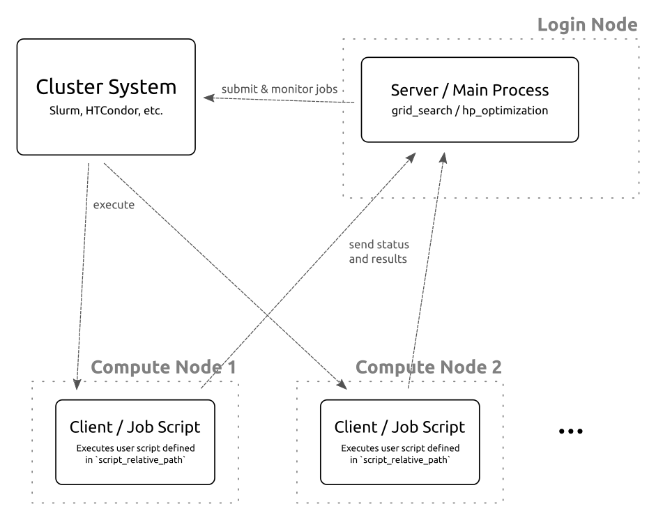

*****************************
Architecture and Nomenclature
*****************************

Server / Main Process
=====================

The server is running in the cluster_utils main process which is started by
`grid_search` or `hp_optimization` on the login node of the cluster.
This process submits jobs to the cluster's scheduler, monitors them and collects the
results.

While the jobs register with the server and send their results, the server itself
doesn't actually send any data to the jobs directly.  It only monitors them based on the
data they sent and on information obtained from the cluster system.

Client / Job Script
===================

The jobs are executed by the cluster system on the compute nodes of the cluster.  They
execute the user script that is specified with the :confval:`script_relative_path`
setting.  This script is expected to call :func:`cluster_utils.initialize_job` in the
beginning, to register at the server (so the server knows that the job started), and
:func:`cluster_utils.finalize_job` at the end to send its results to the server.
