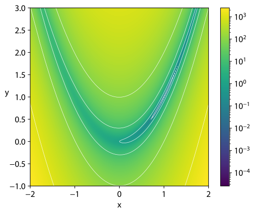

***************************
Tutorial: Basic Grid Search
***************************

In this tutorial, we learn how to set up cluster_utils to run a basic grid search on an
arbitrary optimization function.  It does not cover all available options but instead
shows the minimal steps needed to get started.

--------

Prepare your code
=================

For the sake of this tutorial, we will use the two-dimensional Rosenbrock function.
However, any other function could be used here without affecting the general setup to
run with cluster_utils.

.. code-block:: python

    def rosenbrock(x, y):
        return (1 - x) ** 2 + 100 * (y - x**2) ** 2

The function has a minimum value of zero at (x, y) = (1, 1):

   Image by Nschloe - Own work, CC BY-SA 4.0, `link <https://commons.wikimedia.org/w/index.php?curid=114931732>`_

To be able to run the grid search on this function, we need to write a little script,
called ``rosenbrock.py`` in the following:

.. code-block:: python

    # rosenbrock.py
    from cluster_utils import cluster_main

    def rosenbrock(x, y):
        return (1 - x) ** 2 + 100 * (y - x**2) ** 2

    @cluster_main
    def main(**params):
        value = rosenbrock(params["x"], params["y"])

        metrics = {"rosenbrock_value": value}
        return metrics

    if __name__ == "__main__":
        main()

This script will later be called by cluster_utils for each set of parameters in the grid
search.

**cluster_utils expects your code to be committed to a Git repository.**  This
helps to keep track of the  exact version of the code you ran the grid search on (the
Git revision will be included in the report).  Thus, create a git repository, commit the
``rosenbrock.py`` script and push to the remote (cluster_utils will later pull from
there).

Write a cluster_utils configuration file
========================================

Now we need to write a configuration file to tell cluster_utils how to run it, which
parameters to do the grid search over, where to save results, etc.

This config file can be either JSON, YAML or TOML.  In the following, we use TOML but
the other formats would work just as well (JSON is discouraged, though, as it is rather
annoying to write by hand and doesn't support comments).

.. code-block:: toml

    # Name and base of the output directory.  With the given config, results will be
    # written to /tmp/rosenbrock_grid_search/.
    optimization_procedure_name = "rosenbrock_grid_search"
    results_dir = "/tmp"

    # Automatically generate a PDF report when finished
    generate_report = "when_finished"

    # Path to the job script.  Note that this is relative to the repositories root
    # directory, not to this config file!
    script_relative_path = "rosenbrock.py"

    # How often to run each configuration (useful if there is some randomness
    # in the result).
    restarts = 1

    [git_params]
    # which repo/branch to check out
    url = "<url to your git repository>"
    branch = "main"

    [cluster_requirements]
    request_cpus = 1

    [environment_setup]
    # This section is required, even if no options are set here.

    [fixed_params]
    # Likewise required but may be empty.

    [[hyperparam_list]]
    param = "x"
    values = [0.0, 0.5, 1.0, 1.5, 2.0]

    [[hyperparam_list]]
    param = "y"
    values = [0.0, 0.5, 1.0, 1.5, 2.0]

In natural words, this config tells cluster_utils to do the following: Run grid search
over the two parameters "x" and "y", checking the values "[0.0, 0.5, 1.0, 1.5, 2.0]"
for each of them (entries in ``hyperparam_list``).  Get the Python script
"rosenbrock.py" (``script_relative_path``) from the specified git repository
(``git_params``).  For each combination of "(x, y)", execute the script once
(``restarts``) on a single CPU core (``cluster_requirements``).  When finished, generate
a nice PDF report (``generate_report``) and store it, together with other output files,
in "/tmp/rosenbrock_grid_search" (``optimization_procedure_name``, ``results_dir``).

**Note:** You will need to adjust the settings in the ``[git_params]`` section to point
to the repository that contains the ``rosenbrock.py``.

Run the grid search
===================

Now you can run the grid search locally:

.. code-block:: sh

    python3 -m cluster_utils.grid_search path/to/config.toml

It will detect that it is not executed on a cluster and ask for confirmation to run
locally.  Simply press enter to confirm.  It will then start executing jobs, and, when
finished, create a report.  The output should look something like this:

.. code-block:: text

    Detailed logging available in /tmp/rosenbrock_grid_search/cluster_run.log
    Creating directory /tmp/rosenbrock_grid_search/working_directories
    Logs of individual jobs stored at /home/arada/.cache/cluster_utils/rosenbrock_grid_search-20241031-135040-jobs
    Using project direcory /home/arada/.cache/cluster_utils/rosenbrock_grid_search-20241031-135040-project
    No cluster detected. Do you want to run locally? [Y/n]: 
    Completed:  92%|████████████████████████████████████████████████████▋        | 23/25
    Started execution:  92%|████████████████████████████████████       | 23/25, Failed=0
    Submitted: 100%|█████████████████████████████████████████████████████████████| 25/25

    Killing remaining jobs...
    Results are stored in /tmp/rosenbrock_grid_search
    Procedure successfully finished
    Producing basic report... 
    Report saved at /tmp/rosenbrock_grid_search/rosenbrock_grid_search_report.pdf

All results of the grid search are stored in ``/tmp/rosenbrock_grid_search``.  Most
relevant files are:

- rosenbrock_grid_search_report.pdf: The PDF report which includes a list of best
  parameters and several plots for further analysis.
- all_data.csv: Results of all runs as CSV file.
- cluster_run.log: Log of cluster_utils.  Useful for debugging if something goes wrong.

.. important::

   Every time you run cluster_utils, it creates a temporary working copy of the
   specified git repository.  This means, when you make changes to the code, you need to
   **commit and push** them before running cluster_utils again.
